# JalNetra (FloodGuard AI) — Complete Project Explanation, Technical Architecture & Step-by-Step User / SIH Demo Guide

> **Smart India Hackathon (SIH) 2026 — Problem Statement 26192**  
> **Title:** Flash Flood Prediction System for Hilly Regions using Multi-Source Data  
> **Core Mission Statement:** *"FloodGuard AI estimates flood risk from multi-source observations and provides explainable, hyperlocal decision support."*

---

## 1. Executive Overview: What is JalNetra & Why Does It Exist?

### The Problem in Hilly Regions (PS 26192)
Flash floods in steep Himalayan catchments (such as the **Beas, Parvati, Tirthan, and Sainj valleys in Himachal Pradesh** or the **Alaknanda and Mandakini valleys in Uttarakhand**) behave very differently from slow-moving plains river floods:
1. **Steep Slopes & Rapid Concentration:** Rainfall over high-relief catchments ($1,000\text{ m} - 4,500\text{ m}$ ASL) concentrates into narrow valley gorges within **1 to 6 hours**.
2. **Antecedent Soil Saturation:** A moderate storm on already-saturated topsoil ($0\text{–}7\text{ cm}$ volumetric moisture $> 0.42\text{ m}^3/\text{m}^3$) triggers immediate surface runoff, whereas the same rainfall on dry soil may be absorbed.
3. **Compound Multi-Hazard Risk (Flood + Landslide):** Intense rainfall triggers slope failures in mapped landslide zones, choking tributaries and severing evacuation highways (`NH-3`, `NH-154`, `Mandi–Kamand Road`).
4. **Broad District Alerts Are Not Enough:** A district-wide weather warning tells authorities *that* heavy rain is coming, but not **which specific sub-catchment, village, or road corridor** faces the highest runoff concentration, **why** the model flagged it, or **which evacuation route is safest**.

### Non-Negotiable Engineering Rules Enforced in This Project
- **Zero Dummy Data (`synthetic_rows: 0`, `mock_rows: 0`):** Every single number in the database, feature matrix, and UI comes from real historical observations, real elevation stencils, real OpenStreetMap geometry, or real validated IoT packets.
- **Explicit Degraded / Auth States:** When an official government portal (`IMD API`, `IMD FFG`, `MOSDAC GSMaP_ISRO`, `NASA GPM IMERG`, `CWC`, `NDEM`) requires institutional credentials that are not configured in `.env`, the system explicitly reports **`authentication_required`**—never substituting fake numbers.
- **Strict Separation of Official Warnings vs AI Advisories:** Model outputs are always labelled **`FloodGuard AI Advisory (Decision Support — Non-Official)`** and never impersonate an **`Official Government Warning`** from IMD, CWC, NDMA, or SDMA.
- **Honest Shelter & Road Safety Labelling:** OpenStreetMap shelters without field verification by District Disaster Management (SDM/NDRF) are explicitly marked **`Shelter location found — verification required`** and never called "Safe". Road segments without live flood sensors are marked **`Hazard status unknown`**.

---

## 2. System Pipeline: OBSERVE → FUSE → PREDICT → LOCALIZE → EXPLAIN → ACT

```mermaid
flowchart LR
    subgraph OBSERVE["1. OBSERVE (Multi-Source Ingestion)"]
        A1["Copernicus ERA5-Land Hourly\n(Rain, 4-Layer Soil Moisture, Runoff, Snow)"]
        A2["NASA NASADEM 30m\n(Elevation, Slope, TWI, TRI, Aspect)"]
        A3["GFD / DFO Flood Inventory +\nJRC Surface Water + ISRO Landslide Atlas"]
        A4["OpenStreetMap + OSRM\n(Roads, Rivers, Settlements, Shelters)"]
        A5["ESP32 Field IoT Nodes\n(MQTT / HTTP Rain, Soil, Water Level)"]
        A6["Auth-Gated Official Feeds\n(IMD, GSMaP_ISRO, IMERG, CWC, NDEM)"]
    end

    subgraph FUSE["2. FUSE (Causal Feature Engineering)"]
        B1["Quality & Bounds Validator\n(services/ingestion/quality.py)"]
        B2["31 Physical Watershed Features\nCausal Window [t - W, t] Only"]
    end

    subgraph PREDICT["3. PREDICT (Calibrated ML)"]
        C1["Event-Aware Temporal Split\n(Train / Val / Test / Held-Out Replay)"]
        C2["Calibrated Classifier (v1.0.0)\nProbability [0.0 - 1.0] + Risk Class"]
    end

    subgraph LOCALIZE["4. LOCALIZE (2D GIS)"]
        D1["Sub-Catchment Polygon Mapping\n(8 Beas & Parvati Watersheds)"]
        D2["Exposed Settlements & Road Corridors"]
    end

    subgraph EXPLAIN["5. EXPLAIN (SHAP Attribution)"]
        E1["Local TreeExplainer SHAP Values\nExact Feature Contributions per Area"]
    end

    subgraph ACT["6. ACT (Alerts & Safe Routing)"]
        F1["Operator Alert Workflow\nTrigger -> Review -> Issue -> Ack -> Expire"]
        F2["Multi-Criteria Evacuation Planner\nSafest Feasible vs Shortest Route"]
    end

    OBSERVE --> B1 --> B2 --> C1 --> C2 --> LOCALIZE --> EXPLAIN --> ACT
```



---

## 3. Complete Architecture & File-by-File Codebase Guide

| Directory / File | Purpose & What It Does |
| :--- | :--- |
| [PRD.md](file:///Users/shubhamchandra/Desktop/JalNetra/PRD.md) | Product Requirements Document defining the 10 screens, entities, workflows, and acceptance criteria. |
| [DATA_AND_MODEL_TRAINING_SPEC.md](file:///Users/shubhamchandra/Desktop/JalNetra/DATA_AND_MODEL_TRAINING_SPEC.md) | Specification for real datasets, 31 physical features, event-aware temporal splits, and zero-leakage rules. |
| [DATA_SOURCE_REGISTRY.csv](file:///Users/shubhamchandra/Desktop/JalNetra/DATA_SOURCE_REGISTRY.csv) | Master registry of all 13 official environmental, terrain, hydrological, and GIS data sources. |
| [train_floodguard.py](file:///Users/shubhamchandra/Desktop/JalNetra/train_floodguard.py) | Real-data-only ML training script. Validates provenance (`synthetic_rows == 0`), performs event-aware temporal splitting, trains 4 model families, applies sigmoid probability calibration, and saves artifacts. |
| [services/ingestion/quality.py](file:///Users/shubhamchandra/Desktop/JalNetra/services/ingestion/quality.py) | Physical range, unit, freshness, and schema validator for weather, terrain, and ESP32 IoT sensor readings. Never silently repairs invalid readings. |
| [services/ingestion/adapters.py](file:///Users/shubhamchandra/Desktop/JalNetra/services/ingestion/adapters.py) | Adapters for all 13 sources. Checks `.env` credentials for auth-gated portals, fetches live/historical ERA5-Land and NASADEM data with SHA-256 payload hashing, and computes the 31 causal features. |
| [services/ingestion/build_real_dataset.py](file:///Users/shubhamchandra/Desktop/JalNetra/services/ingestion/build_real_dataset.py) | Builds the curated training dataset (`1,504` rows across `16` documented flood events), the held-out July/August 2023 Himachal Pradesh replay bundle, and the OpenStreetMap road/shelter graph. |
| [services/ml/inference.py](file:///Users/shubhamchandra/Desktop/JalNetra/services/ml/inference.py) | Loads the trained model (`v1.0.0`), calibrator, and SHAP explainer to compute real-time or replay flood probabilities, risk classes, and local feature attributions. |
| [services/alerts/engine.py](file:///Users/shubhamchandra/Desktop/JalNetra/services/alerts/engine.py) | Implements the alert state machine (`triggered → under_review → issued → acknowledged → expired`) and enforces the distinction between `official_warning` and `floodguard_ai_advisory`. |
| [services/routing/planner.py](file:///Users/shubhamchandra/Desktop/JalNetra/services/routing/planner.py) | NetworkX multi-criteria route planner over real OpenStreetMap roads. Computes both the **Safest Feasible Route** (minimizing distance + flood hazard + landslide hazard + road closure penalty) and the **Shortest Distance Route**. |
| [apps/api/db.py](file:///Users/shubhamchandra/Desktop/JalNetra/apps/api/db.py) & [apps/api/models.py](file:///Users/shubhamchandra/Desktop/JalNetra/apps/api/models.py) | SQLAlchemy ORM models for all 22 operational entities. |
| [apps/api/main.py](file:///Users/shubhamchandra/Desktop/JalNetra/apps/api/main.py) | FastAPI backend exposing all 15+ REST endpoints with automatic database seeding from curated artifacts. |
| [apps/web/src/App.tsx](file:///Users/shubhamchandra/Desktop/JalNetra/apps/web/src/App.tsx) | React 19 + TypeScript main application implementing all 10 operational screens and the Citizen Public View. |
| [apps/web/src/components/RiskMapView.tsx](file:///Users/shubhamchandra/Desktop/JalNetra/apps/web/src/components/RiskMapView.tsx) | MapLibre GL JS 2D GIS interactive map with 12 toggleable layers, click inspection, search, legend, and evacuation route rendering. |
| [001_init_postgis_schema.sql](file:///Users/shubhamchandra/Desktop/JalNetra/infrastructure/migrations/001_init_postgis_schema.sql) | Complete PostgreSQL + PostGIS spatial database migration script. |

---

## 4. Data Sources, Physical Features & The "Zero Dummy Data" Contract

### 4.1 Registered Official Sources ([DATA_SOURCE_REGISTRY.csv](file:///Users/shubhamchandra/Desktop/JalNetra/DATA_SOURCE_REGISTRY.csv))
1. **Active Public Archival / Open Research Feeds (Ingested & Cached with SHA-256 Checksums):**
   - **`era5_land` (Copernicus / ECMWF ERA5-Land Hourly Reanalysis):** Hourly precipitation, surface runoff, snow depth, snowmelt, and 4-layer volumetric soil moisture ($0\text{–}7\text{ cm}$, $7\text{–}28\text{ cm}$, $28\text{–}100\text{ cm}$, $100\text{–}255\text{ cm}$).
   - **`nasadem` & `srtm` (NASA NASADEM 30m / USGS SRTM):** Digital elevation stencils ($3\times3$ grid around catchment centroids and uplands) used to compute slope, aspect, profile curvature, Topographic Wetness Index (`TWI`), and Terrain Ruggedness Index (`TRI`).
   - **`gfd` (Global Flood Database / Dartmouth Flood Observatory MODIS v1):** Documented historical flood events and inundation frequency ratios.
   - **`jrc_gsw` (EC JRC Global Surface Water v1.4):** Permanent and seasonal water channel fractions.
   - **`isro_landslide` (ISRO / NRSC Landslide Atlas of India):** District and catchment landslide inventory density (Mandi & Kullu top-ranked hazard zones) and proximity to mapped landslide scarps.
   - **`osm` (OpenStreetMap & OSRM):** Real highway geometries (`NH-3`, `NH-154`, `Manikaran Road`, `Tirthan Valley Road`, `Mandi–Kamand Road`), Beas/Parvati river centerlines, settlements, and emergency shelter coordinates.
2. **Authorized Live Feeds (Explicitly Gated via `.env`):**
   - **`imd_api`**, **`imd_ffg`**, **`gsmap_isro`**, **`gpm_imerg`**, **`cwc_hmo`**, **`ndem`**: Require institutional API keys or portal credentials. When those keys are absent from `.env`, JalNetra displays **`Authentication Required`** on the Sensor & Source Health screen and never fakes their data.

### 4.2 All 31 Physical Model Features Explained
Every prediction uses a 31-feature vector computed strictly from the **causal observation window $[t - W, t]$**:

| Category | Feature Names | Physical Meaning & Why It Matters |
| :--- | :--- | :--- |
| **Cumulative Rainfall Windows** | `rain_1h`, `rain_3h`, `rain_6h`, `rain_12h`, `rain_24h`, `rain_48h`, `rain_72h` | Captures both short cloudburst intensity (`1h–6h`) and multi-day monsoon accumulation (`24h–72h`) in `mm`. |
| **Forecast & Anomaly** | `forecast_rain_6h`, `forecast_rain_24h`, `rain_anomaly_24h`, `antecedent_precipitation_index` | Near-term precipitation guidance (`mm`), deviation from catchment baseline, and 5-day decayed Antecedent Precipitation Index (`API`). |
| **4-Layer Soil Moisture & Runoff** | `soil_water_l1` ($0\text{–}7\text{ cm}$), `soil_water_l2` ($7\text{–}28\text{ cm}$), `soil_water_l3` ($28\text{–}100\text{ cm}$), `soil_water_l4` ($100\text{–}255\text{ cm}$), `runoff`, `snow_depth`, `snowmelt` | When `soil_water_l1` exceeds $\sim 0.42\text{ m}^3/\text{m}^3$, infiltration capacity collapses and incoming rain converts directly into flash-flood surface `runoff`. |
| **30m Terrain Geomorphology** | `elevation`, `slope`, `aspect`, `curvature`, `twi`, `tri`, `flow_accumulation`, `distance_to_stream`, `drainage_density` | Derived from NASADEM 30m. Steep `slope` accelerates flow velocity; high Topographic Wetness Index (`twi`) and `flow_accumulation` identify valley bottoms where water pools. |
| **Historical Flood & Landslide Context** | `historical_flood_frequency`, `landslide_density`, `distance_to_landslide`, `permanent_water_fraction` | Captures recurring floodplain vulnerability (GFD/DFO) and compound slope-failure hazard (ISRO Landslide Atlas). |

---

## 5. Machine Learning Engine, Event-Aware Splitting, Calibration & SHAP

### 5.1 Event-Grouped Temporal Split & Zero Leakage ([train_floodguard.py](file:///Users/shubhamchandra/Desktop/JalNetra/train_floodguard.py))
- **Train Split:** `10` historical events (`940` watershed-hour rows, `2018–early 2022`)
- **Validation Split:** `3` historical events (`282` watershed-hour rows, `mid 2022`) — used for probability calibration and F1 threshold selection
- **Test Split:** `3` historical events (`282` watershed-hour rows, `late 2022`) — held out for final evaluation
- **Replay Events:** `2` major 2023 disasters (`July 2023 Beas River Flash Flood` & `August 2023 Mandi Cloudburst`) are **100% excluded from training, validation, and testing** (`used_in_training: false`).

### 5.2 Stored Evaluation Metrics ([training_metrics.json](file:///Users/shubhamchandra/Desktop/JalNetra/artifacts/metrics/training_metrics.json))
- **Selected Best Model on Validation:** **`random_forest`** (`v1.0.0`)
- **Held-Out Test Set Metrics:**
  - **PR-AUC (Precision-Recall AUC):** `0.9589`
  - **ROC-AUC:** `0.9901`
  - **Recall (Sensitivity):** `0.9167`
  - **Precision:** `0.8049`
  - **F1 Score:** `0.8571`
  - **Brier Score (Calibration Error):** `0.0298`
  - **False-Alarm Rate (FAR):** `0.0325` ($3.25\%$)
  - **Validation Decision Threshold:** `0.41`

---

## 6. Step-by-Step: How to Run, Retrain & Test Everything

1. **Web UI (Already Running):** Open `http://localhost:5173`
2. **Backend API & Swagger Docs (Already Running):** Open `http://localhost:8000/docs`
3. **Rebuild Dataset & Retrain ML Models:**
   ```bash
   /opt/anaconda3/bin/python3 -m services.ingestion.build_real_dataset
   /opt/anaconda3/bin/python3 train_floodguard.py --data data/curated/training_features.parquet --provenance data/curated/training_provenance.json --out artifacts
   ```
4. **Run All 12 Automated Verification Tests:**
   ```bash
   /opt/anaconda3/bin/python3 -m pytest -v
   ```

---

## 7. Screen-by-Screen Walkthrough & Exact SIH Judge Demo Script (All 10 Screens)

### 1. `Operations Dashboard`
- **How to use:** Select a sub-catchment from the top dropdown or click a row in the watershed table; click **`Jump to Peak`** in the top bar to jump to the peak of the July 2023 Himachal Pradesh Beas flood.
- **What to explain:** Point out the side-by-side banner separating **Official Government Warning** from **FloodGuard AI Advisory**, the 4 real-time KPI cards, the 2D GIS map, and the active alert queue.

### 2. `Hyperlocal Risk Map`
- **How to use:** Toggle the 12 GIS layers in the left panel (`Flood Risk`, `Rainfall`, `Forecast`, `Soil Moisture`, `Elevation/Slope`, `Drainage/TWI`, `Rivers`, `Historical Footprints`, `ISRO Landslide Inventory`, `Settlements`, `OSM Roads`, `Shelters & Sensors`). Click any polygon or marker to inspect its telemetry.

### 3. `Area Detail (SHAP & Inputs)`
- **How to use:** Inspect the **Local SHAP Feature Attribution** bars and the full 31-feature physical input table for the selected catchment.
- **What to explain:** Every prediction is decomposed into exact physical contributors (`24h Rain`, `48h Rain`, `5-Day API`, `Topsoil Moisture 0–7cm`, `Slope/TWI`) computed from the actual model inputs.

### 4. `Historical Replay`
- **How to use:** Switch between the two held-out 2023 disasters (`July 2023 Beas River Flash Flood` and `August 2023 Mandi Cloudburst`), step hour-by-hour through the 96-hour timeline, and inspect the 8-stage replay chain (`Observations → Features → Prediction → Risk Map → SHAP → Advisory → Exposed Settlements → Safe Route`).

### 5. `Alert Center`
- **How to use:** Click **`+ Generate FloodGuard AI Advisory`** and walk an alert through `triggered → under_review → issued → acknowledged → expired`. Show the immutable operator audit trail.

### 6. `Evacuation Planner`
- **How to use:** Select an exposed settlement (e.g., `Pandoh Bazar & Dam Colony` or `Mandi Victoria Bridge`) and click **`Compute Evacuation Route`**.
- **What to explain:** Compare the **Safest Feasible Route** (which detours via higher-elevation hill roads to avoid flooded valley corridors and landslide zones) against the **Shortest Distance Route**, and point out how unverified OSM shelters are explicitly flagged as `Shelter location found — verification required`.

### 7. `Sensor & Source Health`
- **How to use:** Show the 13 official data sources (including explicit `Authentication Required` badges for unconfigured credentialed portals), click **`Check Live Open-Meteo Feed Now`**, and submit a live ESP32 IoT sensor reading using the HTTP ingestion form.

### 8. `Data Provenance`
- **How to use:** Show `synthetic_rows: 0`, `mock_rows: 0`, the SHA-256 dataset and cache hashes, and the live database audit trail.

### 9. `Model Evaluation`
- **How to use:** Show the stored test metrics (`PR-AUC = 0.9589`, `Recall = 91.67%`, `Brier = 0.0298`), calibration curve bins, global SHAP importance, and the 7-check automated zero-leakage verification report.

### 10. `Public / Citizen View`
- **How to use:** Click **`Citizen Public View`** in the top-right header bar to show the plain-language public portal (*"What is happening?"*, *"What should I do?"*, verified vs verification-required shelters, and `112 / 1070 / 1077` emergency helplines).
